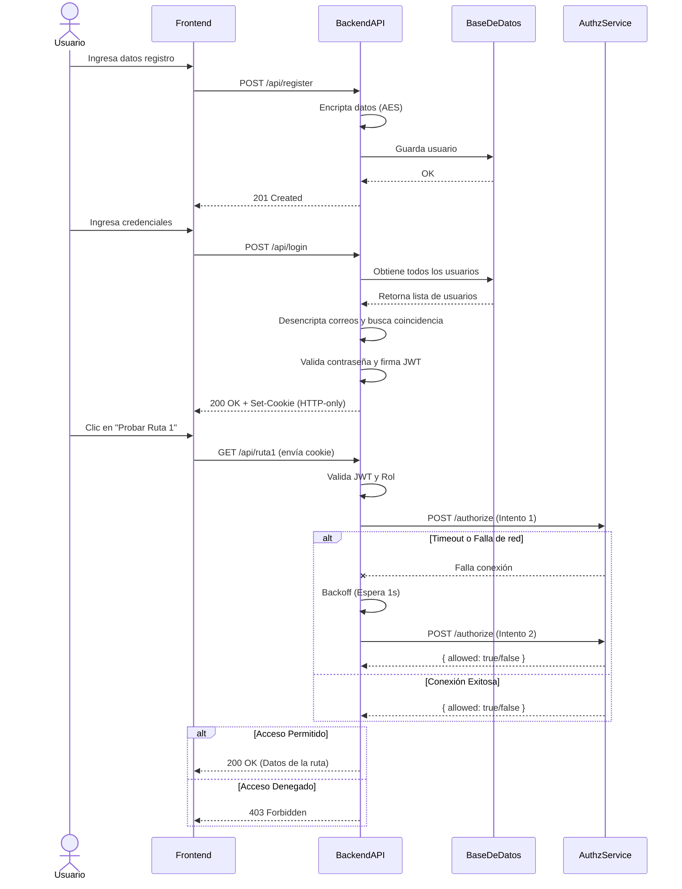

# Práctica 2: Autenticación y Autorización

Este repositorio contiene la implementación de la Práctica 2, cumpliendo con todos los requerimientos de seguridad, diseño y arquitectura solicitados.

## Tecnologías Utilizadas

- **Backend:** Node.js, Express.js
- **Microservicio de Autorización:** Node.js, Express.js
- **Base de Datos:** SQLite
- **Autenticación:** JWT almacenado en HTTP-only cookies
- **Encriptación:** Algoritmo AES (crypto module nativo de Node.js)
- **Frontend:** HTML5, Vanilla JavaScript, Tailwind CSS

## Diagrama de Secuencia

El siguiente diagrama muestra el flujo completo de autenticación y autorización, incluyendo la comunicación entre el Backend y el Microservicio de Autorización con ciclo de reintentos.



## Principios SOLID Aplicados

### 1. Principio de Responsabilidad Única (SRP - Single Responsibility Principle)
**Evidencia en código:** Archivo `backend/src/utils/crypto.js`
**Justificación:** Este archivo se encarga **exclusivamente** de la lógica de encriptación y desencriptación AES. No maneja base de datos, no genera tokens, ni responde peticiones HTTP.
```javascript
// backend/src/utils/crypto.js
const encrypt = (text) => { /* lógica aes */ };
const decrypt = (text) => { /* lógica aes */ };
module.exports = { encrypt, decrypt };
```

### 2. Principio Abierto/Cerrado (OCP - Open/Closed Principle)
**Evidencia en código:** Archivo `authz-service/server.js`
**Justificación:** La lógica de validación de roles y rutas en el microservicio utiliza un mapa/diccionario (`rolePermissions`). Si necesitamos agregar nuevas rutas o nuevos roles, simplemente agregamos elementos a este mapa sin necesidad de modificar (cerrado a modificación) la función que evalúa el permiso (abierto a extensión).
```javascript
// authz-service/server.js
const rolePermissions = {
    'Admin': ['/api/ruta1', '/api/ruta2'],
    'Cliente': ['/api/ruta2'],
    // 'Moderador': ['/api/ruta3'] // Fácil de extender
};
```

### 3. Principio de Sustitución de Liskov (LSP - Liskov Substitution Principle)
**Evidencia en código:** Middleware `authMiddleware.js`
**Justificación:** En nuestro manejo de errores de JWT, tratamos el error `TokenExpiredError` como un subtipo válido de error que la aplicación puede manejar de forma especial (renovando el token). El sistema no se rompe al recibir diferentes implementaciones/tipos de errores de la librería `jsonwebtoken`, comportándose correctamente.

### 4. Principio de Segregación de Interfaces (ISP - Interface Segregation Principle)
**Evidencia en código:** División entre `backend/src/server.js` y `authz-service/server.js`.
**Justificación:** En lugar de tener una "super interfaz API" en un solo servidor monolítico que requiera que todos los clientes conozcan todas las operaciones (auth + authz), hemos segregado la lógica de Autorización en un microservicio independiente. Así, el backend principal consume solo la interfaz estricta que necesita (`POST /authorize`).

### 5. Principio de Inversión de Dependencias (DIP - Dependency Inversion Principle)
**Evidencia en código:** Archivo `backend/src/routes/api.js` y `backend/src/server.js`
**Justificación:** El servidor principal (`server.js`) no depende directamente de las funciones concretas de los controladores o los middlewares para su configuración global. Confía en la abstracción `apiRoutes` (`const apiRoutes = require('./routes/api');`), delegando los detalles de implementación a los módulos de bajo nivel.

## Instrucciones de Ejecución

1. Clonar el repositorio.
2. Abrir una terminal en `P2/backend` y ejecutar:
   ```bash
   npm install
   npm start # (o node src/server.js)
   ```
3. Abrir otra terminal en `P2/authz-service` y ejecutar:
   ```bash
   npm install
   npm start # (o node server.js)
   ```
4. Acceder en el navegador a: `http://localhost:3000`

## Guía de Pruebas (Evaluación)

A continuación, los pasos para validar todos los requerimientos funcionales:

### 1. Módulo de Registro y Login
- **Registro:** En la página principal, haz clic en "Regístrate aquí". Crea un usuario con rol **Cliente** y otro con rol **Admin**.
- **Login:** Inicia sesión con alguno de los usuarios creados. Serás redirigido automáticamente a la página del "Dashboard".

### 2. Encriptación AES en Base de Datos
- Al abrir el archivo `backend/database.sqlite` con un visor como DataGrip o SQLite Browser, notarás que los nombres, correos y contraseñas no son legibles. Están cifrados usando AES-256-CBC, garantizando la seguridad de los datos en reposo.

### 3. JWT en cookie HTTP-only y Renovación Automática
- **HTTP-only:** En tu navegador (ej. Chrome), presiona `F12` para abrir las herramientas de desarrollador. En la pestaña de **Application** -> **Cookies**, verás la cookie `token` con el atributo `HTTP-only` marcado.
- **Renovación automática:** El token está configurado para expirar en 10 segundos, con un tiempo de gracia de 5 minutos.
  - Haz login, espera más de 10 segundos y luego haz clic en el botón de "Ejecutar Ruta".
  - La petición funcionará y en la consola del backend verás el mensaje: `[AUTH] Token renovado para usuario...`.

### 4. Autorización por roles y Microservicio (Retry Loop)
- En el Dashboard, inicia sesión como **Cliente**:
  - Probar Ruta 1: Mostrará ❌ *403 Error Forbidden. Access denied for your role.*
  - Probar Ruta 2: Mostrará ✅ *200 OK (Acceso permitido)*.
- Inicia sesión como **Admin**:
  - Ambas rutas mostrarán ✅ *200 OK*.
- **Prueba del Retry Loop:**
  1. Haz login en el Dashboard.
  2. Apaga el microservicio de autorización (`authz-service`) con `Ctrl + C`.
  3. Haz clic en "Ejecutar Ruta".
  4. Observa la consola del backend. Intentará reconectarse mostrando: `[RETRY] Reintentando conexion a authz-service. Intento 1... Intento 2...`.
  5. Si rápidamente vuelves a encender el microservicio antes del intento 3, la petición será exitosa. Si dejas que pasen los intentos, la interfaz mostrará un error por timeout.
