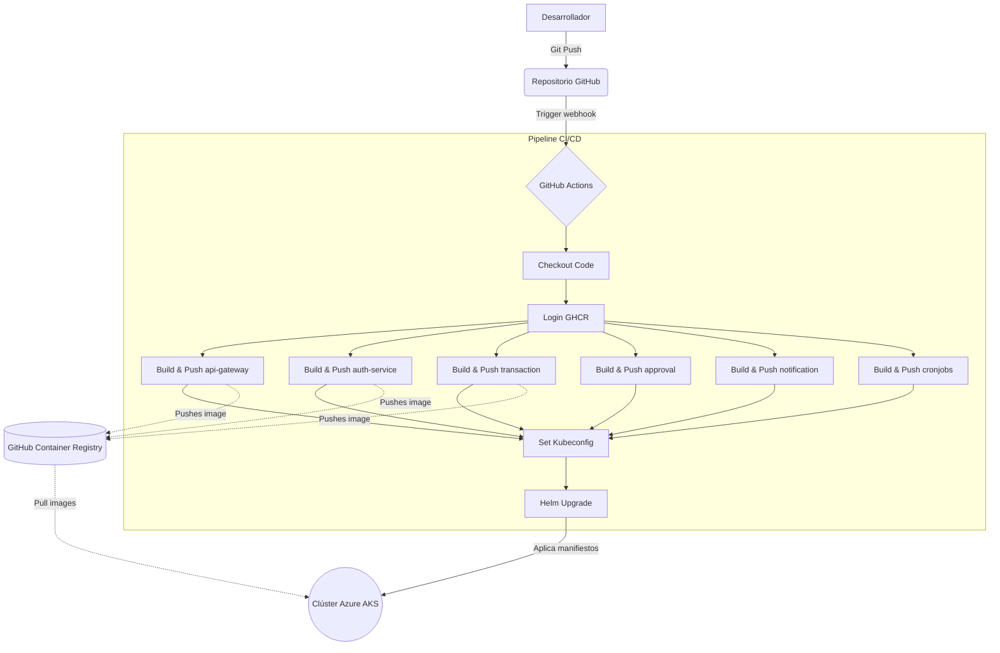

# Práctica 7: Integración y Despliegue Continuo (CI/CD)

## Documentación Técnica del Flujo CI/CD

El pipeline implementado en `.github/workflows/ci.yml` tiene como objetivo automatizar completamente el ciclo de vida del código, desde que un desarrollador hace push a la rama `main` hasta que los cambios se reflejan en el clúster de Kubernetes en Azure (AKS).

### Flujo de Trabajo (Workflow)

El workflow se divide en los siguientes pasos lógicos:

1. **Trigger (Disparador):** El pipeline se ejecuta automáticamente cuando detecta un `push` a la rama `main`, y siempre que haya cambios en el código fuente de los microservicios (`P5/src/**`), en los manifiestos de Helm (`P6/charts/**`) o en el propio archivo del pipeline (`.github/workflows/**`).

2. **Checkout del Código:** Utiliza la acción estándar `actions/checkout@v4` para descargar el repositorio en el runner de GitHub (que es un entorno `ubuntu-latest`).

3. **Autenticación en el Registry (GHCR):** Mediante `docker/login-action@v3`, el runner se autentica en GitHub Container Registry (`ghcr.io`) usando el token nativo temporal `${{ secrets.GITHUB_TOKEN }}`. No fue necesario exponer credenciales personales.

4. **Construcción y Push de Imágenes (Dockerización):** Se ejecutan múltiples pasos en paralelo/secuencial para construir las imágenes Docker de los 6 microservicios.
   - Para garantizar el control de versiones y evitar caché erróneo, cada imagen se etiqueta con el hash único del commit de Git (`${{ github.sha }}`).
   - Las imágenes son inmediatamente subidas (pushed) a GHCR, quedando disponibles de manera pública.

5. **Configuración del Entorno K8s (AKS):**
   - Se instala la herramienta `kubectl` en el runner.
   - A través de un secreto de repositorio inyectado (`KUBECONFIG`), se configura el acceso seguro para que GitHub Actions pueda comunicarse con el clúster remoto en Azure.

6. **Despliegue Automático con Helm:**
   - Se instala Helm en el runner.
   - Se ejecuta el comando `helm upgrade --install`, inyectando dinámicamente las nuevas etiquetas de las imágenes (el hash del commit) hacia el clúster, forzando a los pods a actualizarse a la nueva versión sin tiempo de inactividad (Zero Downtime Deployment) gracias a la estrategia `RollingUpdate` definida en los charts.

## Diagrama del Pipeline

A continuación se muestra el diagrama visual de la arquitectura del flujo automatizado:

