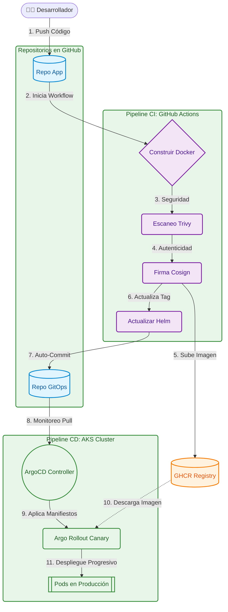

# Práctica 8: Seguridad y GitOps 🚀

Este repositorio contiene la documentación oficial y los entregables correspondientes a la Práctica 8, enfocada en la implementación de despliegues continuos seguros utilizando la metodología GitOps.

---

## ⚙️ Tabla 4.1: Configuración Inicial

| Parámetro | Valor |
|-----------|-------|
| **Carnet** | `201712620` |
| **Repositorio de Código** | [Pr-cticas-SA-B-201712620](https://github.com/AndresCalvo98/Pr-cticas-SA-B-201712620) |
| **Repositorio GitOps** | [software-avanzado-gitops](https://github.com/AndresCalvo98/software-avanzado-gitops) |
| **Nombre de la App** | `sa-platform-app` |
| **Namespace** | `produccion` |
| **Imagen Base** | `ghcr.io/andrescalvo98/sa-api-gateway:d66125fe88f7cedfaa8ad25fe2a2ffe9b598dafa` |
| **Cosign Identity Regexp** | `https://github.com/AndresCalvo98/Pr-cticas-SA-B-201712620/.*` |
| **Cosign Issuer** | `https://token.actions.githubusercontent.com` |

---

## 🏗️ 1.1 Documentación del Entorno

Para el desarrollo de esta práctica, se diseñó una arquitectura orientada a microservicios donde todo el tráfico entrante es gestionado por un API Gateway central.

### 🌐 Endpoints y Enrutamiento
El tráfico es recibido internamente en el clúster o mediante el Ingress configurado (`sa-platform-ingress`), el cual enruta las peticiones a los siguientes servicios subyacentes:

| Microservicio | Ruta Expuesta |
|---------------|---------------|
| **Auth Service** | `/api/auth` |
| **Transaction Service** | `/api/transactions` |
| **Approval Service** | `/api/approval` |
| **Notification Service** | `/api/notification` |

### 📦 Imágenes de Contenedores
Todas las imágenes utilizadas fueron construidas, firmadas y escaneadas mediante nuestro pipeline de CI, y se encuentran alojadas en Github Container Registry (GHCR):

- `ghcr.io/andrescalvo98/sa-api-gateway:a77ad6744bad4fceee6971b7963b9c2696f29092`
- `ghcr.io/andrescalvo98/sa-approval-service:a77ad6744bad4fceee6971b7963b9c2696f29092`
- `ghcr.io/andrescalvo98/sa-auth-service:a77ad6744bad4fceee6971b7963b9c2696f29092`
- `ghcr.io/andrescalvo98/sa-notification-service:a77ad6744bad4fceee6971b7963b9c2696f29092`
- `ghcr.io/andrescalvo98/sa-transaction-service:a77ad6744bad4fceee6971b7963b9c2696f29092`
- `rabbitmq:3.13-management` *(Broker de mensajería oficial)*

### 📈 Políticas de Autoescalado (HPA)
Para garantizar la resiliencia y alta disponibilidad, cada microservicio cuenta con un **Horizontal Pod Autoscaler**. La política configurada asegura un mínimo de **2 réplicas** y un máximo de **5 réplicas**, activando el escalado horizontal automáticamente si el consumo de CPU promedio supera el **70%**.

---

## 🗺️ 1.2 Diagrama GitOps

*A continuación se detalla el flujo completo, desde que el desarrollador hace un push hasta que ArgoCD reconcilia el estado en el clúster.*

---

## 🚨 1.3 Informe de Incidente (Post-Mortem)

**Contexto del Incidente:**
Durante la validación de nuestra estrategia de despliegue progresivo (Canary), inyectamos deliberadamente una falla conocida como `fake-fail`. El objetivo era evaluar la capacidad de respuesta automática del clúster frente a una versión defectuosa en ambiente de producción.

**Causa Raíz:**
Mientras el recurso `Rollout` se encontraba en la fase inicial de Canary (donde solo un porcentaje menor del tráfico es expuesto a los nuevos pods), el componente `AnalysisRun` comenzó a monitorizar las métricas. La falla sintética provocó que la tasa de error superara rápidamente el límite máximo del 5% que habíamos configurado en nuestro `AnalysisTemplate`.

**Resolución Automática y Recuperación:**
Al detectar que las métricas superaban el umbral de tolerancia, el controlador de **Argo Rollouts** intervino inmediatamente:
1. Detuvo el avance del despliegue Canary, evitando que más usuarios se vieran afectados.
2. Ejecutó un *rollback* automático, redireccionando el 100% del tráfico de vuelta a la versión estable anterior.

Gracias a este mecanismo, no experimentamos ninguna caída total del servicio. Una vez resuelto el problema, corregimos el fallo en el código fuente, el pipeline generó una imagen limpia, y ArgoCD logró completar el despliegue exitosamente en el siguiente ciclo.

---

## 📚 1.4 Fundamentos Teóricos

> **1. ¿Qué ventajas ofrece GitOps respecto a las metodologías de despliegue tradicionales?**  
> Lo que más destaco de implementar GitOps es que nuestro repositorio de Git actúa como la "única fuente de verdad". Si alguien modifica o elimina un recurso manualmente por error dentro del clúster, ArgoCD lo detecta y lo vuelve a crear exactamente como está definido en el repositorio. Además, mejora drásticamente la seguridad: en lugar de darle credenciales a nuestro pipeline de CI (estrategia *Push*), es el propio clúster el que consulta el repositorio de manera segura (estrategia *Pull*).

> **2. Describa cómo funciona el ciclo de reconciliación en herramientas como ArgoCD.**  
> El ciclo de reconciliación es esencialmente un bucle infinito en el que el controlador de Argo CD compara dos cosas: el estado real de los recursos en Kubernetes y el estado deseado declarado en los manifiestos de Git. Si detecta alguna diferencia (por ejemplo, actualizamos el tag de una imagen), marca la aplicación en estado *Out of Sync* y aplica inmediatamente los cambios necesarios en el clúster para que vuelva a estar sincronizado.

> **3. ¿Cuál es el propósito principal de implementar estrategias como Canary o Blue-Green?**  
> El propósito es minimizar el riesgo de afectar a los usuarios al liberar nuevas versiones.  
> - Con **Blue-Green**, levantamos un entorno completamente paralelo, lo probamos internamente, y luego cambiamos el tráfico de un solo golpe, logrando cero tiempo de inactividad.  
> - Con **Canary** (la que usamos en la práctica), el enfoque es gradual: liberamos la nueva versión solo a un pequeño porcentaje de usuarios (ej. 10%). Si el sistema monitorea que todo está bien, aumenta el tráfico progresivamente; si algo falla, el impacto es mínimo y el rollback es casi instantáneo.

> **4. ¿Por qué es importante firmar las imágenes y escanearlas en el flujo de CI/CD?**  
> Todo se resume en "Seguridad en la Cadena de Suministro". Escanear imágenes con herramientas como **Trivy** nos asegura que no estamos metiendo contenedores con vulnerabilidades críticas (CVEs) a producción. Por su parte, firmar las imágenes con **Cosign** garantiza la integridad del software: el clúster puede verificar criptográficamente que la imagen que está a punto de correr realmente fue construida por nuestro pipeline oficial y no fue alterada por un atacante en el registry.
