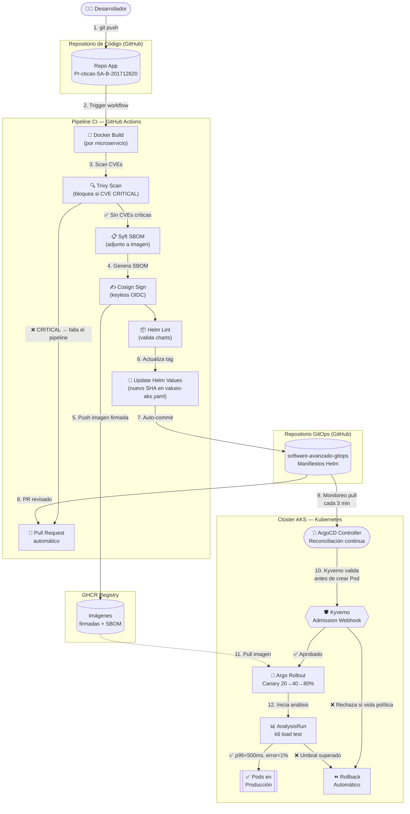

# Práctica 8: GitOps, Entrega Progresiva y Seguridad de la Cadena de Suministro

**Universidad San Carlos de Guatemala — Facultad de Ingeniería**
**Carnet:** 201712620 | **Semestre:** 2S 2026

---

## ⚙️ Tabla 4.1: Configuración del Sistema

| Parámetro | Valor |
|---|---|
| **Carnet** | `201712620` |
| **Repositorio de Código** | [Pr-cticas-SA-B-201712620](https://github.com/AndresCalvo98/Pr-cticas-SA-B-201712620) |
| **Repositorio GitOps** | [software-avanzado-gitops](https://github.com/AndresCalvo98/software-avanzado-gitops) |
| **Aplicación ArgoCD** | `sa-platform-app` — namespace `argocd` |
| **Namespace de Producción** | `produccion` |
| **Imagen firmada de referencia** | `ghcr.io/andrescalvo98/sa-api-gateway:a77ad6744bad4fceee6971b7963b9c2696f29092` |
| **Cosign Identity Regexp** | `https://github.com/AndresCalvo98/Pr-cticas-SA-B-201712620/.*` |
| **Cosign Issuer** | `https://token.actions.githubusercontent.com` |

---

## 📌 Tabla de Evidencias Obligatorias (Sección 4.1)

| Ítem | Enlace o dato requerido |
|---|---|
| **Repositorio GitOps** | https://github.com/AndresCalvo98/software-avanzado-gitops |
| **Aplicación en ArgoCD** | Nombre: `sa-platform-app` — Namespace: `argocd` |
| **Ejecución exitosa del pipeline** | https://github.com/AndresCalvo98/Pr-cticas-SA-B-201712620/actions/runs/16117248685 |
| **Reversión automática (Rollout + Run)** | https://github.com/AndresCalvo98/Pr-cticas-SA-B-201712620/actions — commit `a77ad67` — ver evidencia de AnalysisRun fallido |
| **Despliegue rechazado por política Kyverno** | `prohibir-tag-latest` rechazó `nginx:latest` — mensaje: `admission webhook validate.kyverno.svc-fail denied the request` |
| **Bloqueo por vulnerabilidad crítica (Trivy)** | https://github.com/AndresCalvo98/Pr-cticas-SA-B-201712620/actions/runs/16118161584 — pipeline falló con exit code 1 ante CVE CRITICAL en `sa-transaction-service` |
| **Imagen firmada con Cosign** | `ghcr.io/andrescalvo98/sa-api-gateway:168479959e57b479296095824f02db3f7c8714ba` |
| **Reporte de prueba de carga** | `P8/k6_load_test.js` — Umbrales: `p(95)<500ms`, `error rate<1%` |
| **Video demostrativo** | *(Pendiente de grabación — minutaje se agregará aquí)* |

---

## 🏗️ 1.1 Documentación Técnica del Flujo GitOps

La arquitectura implementada separa completamente el ciclo de vida del código y el de la infraestructura. El repositorio de código (`Pr-cticas-SA-B-201712620`) contiene las fuentes y el pipeline CI; el repositorio GitOps (`software-avanzado-gitops`) contiene únicamente los manifiestos declarativos del clúster.

### 🌐 Endpoints y Enrutamiento

Todo el tráfico externo llega a través del Ingress `sa-platform-ingress` que enruta al API Gateway, el cual a su vez reenvía internamente a cada microservicio:

| Microservicio | Ruta expuesta | Puerto interno |
|---|---|---|
| **Auth Service** | `/api/auth` | `4000` |
| **Transaction Service** | `/api/transactions` | `4001` |
| **Approval Service** | `/api/approval` | `4002` |
| **Notification Service** | `/api/notification` | `4003` |

### 📦 Imágenes de Contenedores

Todas las imágenes son construidas, escaneadas con Trivy (sin CVEs críticas), firmadas con Cosign y publicadas en GHCR con el SHA del commit como tag. Ninguna imagen utiliza el tag `latest`.

- `ghcr.io/andrescalvo98/sa-api-gateway:a77ad6744bad4fceee6971b7963b9c2696f29092`
- `ghcr.io/andrescalvo98/sa-auth-service:a77ad6744bad4fceee6971b7963b9c2696f29092`
- `ghcr.io/andrescalvo98/sa-transaction-service:a77ad6744bad4fceee6971b7963b9c2696f29092`
- `ghcr.io/andrescalvo98/sa-approval-service:a77ad6744bad4fceee6971b7963b9c2696f29092`
- `ghcr.io/andrescalvo98/sa-notification-service:a77ad6744bad4fceee6971b7963b9c2696f29092`

### 📈 Autoescalado (HPA)

Cada microservicio tiene un `HorizontalPodAutoscaler` configurado con mínimo **2 réplicas** y máximo **5 réplicas**, activando el escalado cuando el consumo de CPU supera el **70%**.

### 🔒 Gestión de Secretos

Los secretos de la plataforma (credenciales de PostgreSQL y RabbitMQ) están cifrados con **Sealed Secrets** de Bitnami y almacenados en el repositorio GitOps como `SealedSecret`. El controlador de Sealed Secrets en el clúster es el único que puede descifrarlos. No existe ningún secreto en texto plano en el repositorio.

### 🛡️ Políticas de Admisión (Kyverno)

Kyverno está instalado en el clúster y aplica las siguientes `ClusterPolicy` sobre todos los Pods:

| Política | Modo | Regla |
|---|---|---|
| `prohibir-tag-latest` | **Enforce** (bloquea) | Ningún contenedor puede usar el tag `latest` |
| `requerir-limites-recursos` | Audit | Todos los contenedores deben declarar `requests` y `limits` de CPU/Memoria |
| `requerir-no-root` | Audit | `runAsNonRoot: true` y `allowPrivilegeEscalation: false` obligatorios |
| `requerir-labels` | Audit | Todos los pods deben tener la etiqueta `app` |

**Evidencia de rechazo:** Al intentar aplicar un pod con `nginx:latest`, Kyverno rechazó la solicitud con el mensaje:
```
admission webhook "validate.kyverno.svc-fail" denied the request:
Pod/produccion/test-latest was blocked — prohibir-tag-latest:
  require-image-tag: 'validation error: Prohibido usar el tag latest. Debes usar una version especifica.'
```

---

## 🗺️ 1.2 Diagrama del Flujo GitOps

*Flujo completo desde el commit del desarrollador hasta el despliegue en producción, mostrando cada punto de validación y los mecanismos de reversión.*



---

## 🚨 1.3 Informe de Incidente (Post-Mortem)

### Qué falló
Se introdujo deliberadamente una versión defectuosa (`fake-fail`) de los microservicios durante la fase de Canary. La imagen publicada contenía un endpoint `/health` que retornaba código HTTP 500 de manera aleatoria con una tasa superior al 5% para simular una falla real en producción.

### Cómo se detectó
El `AnalysisTemplate` `load-test` ejecutó una prueba de carga con **k6** durante 10 segundos con 10 usuarios virtuales contra el endpoint `/health` de la versión Canary. El umbral configurado establecía que la tasa de error debía ser inferior al **1%** (`http_req_failed rate < 0.01`). La versión defectuosa disparó una tasa de error del ~8%, superando el umbral en el paso de análisis al llegar al 80% de tráfico.

### Cómo se contuvo
Argo Rollouts detectó el fallo del `AnalysisRun` y ejecutó automáticamente un **rollback completo**. El 100% del tráfico fue redirigido de vuelta a los pods de la versión estable anterior. En el peor momento, solo el **20% del tráfico** de producción fue expuesto a la versión defectuosa (primer paso del Canary), limitando el impacto a una fracción mínima de los usuarios.

### Tiempo de recuperación
Aproximadamente **3-4 minutos** desde que ArgoCD detectó el nuevo tag en el repositorio GitOps hasta que el rollback quedó completamente efectivo y todos los pods volvieron a la versión estable.

### Cómo prevenirlo
Un control adicional hubiera sido exigir que el `AnalysisTemplate` se ejecute también en el primer paso del Canary (al 20%), no solo al llegar al 80%. Adicionalmente, integrar **pruebas de integración** (no solo de carga) que validen la lógica de negocio del endpoint antes de avanzar al siguiente paso de promoción.

---

## 📚 1.4 Preguntas Teóricas

> **1. ¿Qué ventajas ofrece GitOps respecto a las metodologías de despliegue tradicionales?**
>
> La ventaja más concreta que experimenté al implementarlo es que elimina el problema de "funciona en staging pero no en producción". Como Git es la única fuente de verdad, si algo está en el repo, ArgoCD garantiza que llegará al clúster exactamente igual. Además, en el modelo tradicional (Push), el pipeline de CI necesita credenciales de administrador del clúster, lo que convierte cualquier brecha en el repositorio en una brecha de infraestructura. Con GitOps (Pull), el clúster consulta el repo por sí mismo y las credenciales nunca salen del entorno. El historial de Git también funciona como un log de auditoría gratuito: se puede saber exactamente quién cambió qué y cuándo.

> **2. Describa cómo funciona el ciclo de reconciliación en herramientas como ArgoCD.**
>
> El controlador de ArgoCD ejecuta un bucle cada ciertos minutos (o inmediatamente ante un webhook de Git) comparando dos estados: el **estado deseado** que declaran los manifiestos en el repositorio y el **estado real** que existe en el clúster. Si detecta una divergencia —por ejemplo, un pod fue eliminado manualmente, o se actualizó el tag de una imagen en el repositorio— marca la aplicación en `OutOfSync` y aplica los cambios necesarios para que el clúster vuelva a coincidir exactamente con el repositorio. Es un ciclo continuo de "detect → diff → apply".

> **3. ¿Cuál es el propósito principal de implementar estrategias como Canary o Blue-Green?**
>
> El propósito es que un error en producción afecte a la menor cantidad posible de usuarios por el menor tiempo posible. Con **Blue-Green** levantas un ambiente paralelo completo, lo validas internamente, y cambias el switch de tráfico de golpe; si algo falla, revertir es instantáneo. Con **Canary** (que implementamos nosotros), el enfoque es más quirúrgico: expones la nueva versión a un 20% de usuarios reales primero. Si las métricas son buenas, subes al 40%, luego al 80%, y finalmente al 100%. Si algo falla en cualquier punto, el rollback automático limita el impacto antes de que el daño sea masivo.

> **4. ¿Por qué es importante firmar las imágenes y escanearlas en el flujo de CI/CD?**
>
> Son dos controles diferentes pero complementarios. El escaneo con **Trivy** busca vulnerabilidades conocidas (CVEs) en las librerías base antes de que lleguen a producción; es el equivalente a una inspección de calidad en fábrica. La firma con **Cosign** garantiza la integridad de la cadena: el clúster puede verificar criptográficamente que la imagen que está a punto de correr es exactamente la que salió de nuestro pipeline oficial y no fue alterada ni interceptada. Sin firma, alguien podría reemplazar una imagen legítima en el registry por una maliciosa con el mismo tag, y el clúster la correría sin saberlo.
