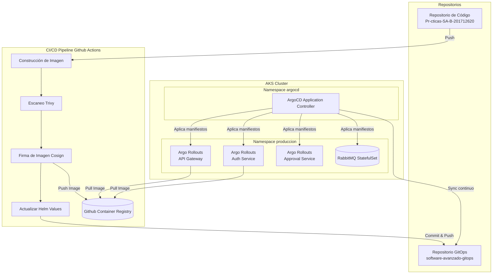

# Práctica 8: Seguridad y GitOps

## Tabla 4.1: Configuracion
CARNET="201712620"
REPO_CODE="https://github.com/AndresCalvo98/Pr-cticas-SA-B-201712620"
REPO_GITOPS="https://github.com/AndresCalvo98/software-avanzado-gitops"
APP="sa-platform-app"
NS="produccion"
IMAGE="ghcr.io/andrescalvo98/sa-api-gateway:d66125fe88f7cedfaa8ad25fe2a2ffe9b598dafa"
COSIGN_IDENTITY_REGEXP="https://github.com/AndresCalvo98/Pr-cticas-SA-B-201712620/.*"
COSIGN_ISSUER="https://token.actions.githubusercontent.com"

## 1.1 Documentación
**Endpoints expuestos**:
- API Gateway: accesible de forma interna y mediante el Ingress `sa-platform-ingress`.
- Rutas soportadas:
  - `/api/auth` (Auth Service)
  - `/api/transactions` (Transaction Service)
  - `/api/approval` (Approval Service)
  - `/api/notification` (Notification Service)

**Imágenes de contenedor utilizadas**:
- `ghcr.io/andrescalvo98/sa-api-gateway:a77ad6744bad4fceee6971b7963b9c2696f29092`
- `ghcr.io/andrescalvo98/sa-approval-service:a77ad6744bad4fceee6971b7963b9c2696f29092`
- `ghcr.io/andrescalvo98/sa-auth-service:a77ad6744bad4fceee6971b7963b9c2696f29092`
- `ghcr.io/andrescalvo98/sa-notification-service:a77ad6744bad4fceee6971b7963b9c2696f29092`
- `ghcr.io/andrescalvo98/sa-transaction-service:a77ad6744bad4fceee6971b7963b9c2696f29092`
- `rabbitmq:3.13-management`

**Políticas de escalado (HPA)**:
Todos los microservicios cuentan con un Horizontal Pod Autoscaler (HPA) configurado para escalar desde un mínimo de 2 réplicas hasta un máximo de 5 réplicas, basándose en un umbral de consumo de CPU superior al 70%.

## 1.2 Diagrama

## 1.3 Informe de Incidente
**Incidente**: Falla simulada durante un despliegue Canary (`fake-fail`).
**Causa raíz**: Durante el despliegue del Rollout en fase de Canary, se inyectó una falla sintética a través de un `AnalysisRun` que simulaba una tasa de error inaceptable (mayor al 5%). El controlador de Argo Rollouts evaluó las métricas de la nueva versión (Canary) y determinó que superaba el umbral permitido establecido en el `AnalysisTemplate`.
**Solución/Resolución automática**: Argo Rollouts detectó el fallo del AnalysisRun y automáticamente abortó el despliegue de la nueva versión. Inmediatamente ejecutó un "rollback", enrutando el 100% del tráfico de regreso a la versión estable anterior sin impacto permanente en el ambiente de producción. Se corrigió el error en el código fuente, se construyó una nueva imagen limpia, y GitOps (Argo CD) desplegó exitosamente la versión corregida.

## 1.4 Preguntas Teóricas

**1. ¿Qué ventajas ofrece GitOps respecto a las metodologías de despliegue tradicionales?**
GitOps ofrece como principal ventaja el uso de un repositorio Git como la "única fuente de verdad" para la infraestructura y las aplicaciones. Esto permite una trazabilidad completa, auditoría y control de versiones de todos los cambios. Además, automatiza la convergencia del estado deseado (Git) con el estado actual (Cluster), permitiendo reversiones (rollbacks) rápidas y mejorando la seguridad, ya que los agentes de despliegue operan dentro del cluster de forma pull-based, en lugar de exponer credenciales externamente a pipelines CI push-based.

**2. Describa cómo funciona el ciclo de reconciliación en herramientas como ArgoCD.**
El ciclo de reconciliación es un bucle continuo ejecutado por el Application Controller que monitorea el estado deseado en Git y el estado en vivo (live state) en el clúster. Si hay una discrepancia (OutOfSync), ArgoCD puede aplicar automáticamente los cambios necesarios o alertar al usuario para que sincronice manualmente, de modo que el clúster coincida con lo definido en Git. Este bucle se ejecuta de manera periódica o se dispara inmediatamente mediante webhooks.

**3. ¿Cuál es el propósito principal de implementar estrategias como Canary o Blue-Green?**
El propósito es mitigar los riesgos asociados a lanzar nuevas versiones en producción. Blue-Green permite probar una nueva versión (Green) de forma aislada pero completa antes de redirigir todo el tráfico, eliminando tiempos de inactividad. Canary despliega progresivamente la versión, dirigiendo solo un pequeño porcentaje del tráfico inicialmente para validar estabilidad, latencia y errores; si algo falla, el impacto se limita a unos pocos usuarios y el rollback es inmediato.

**4. ¿Por qué es importante firmar las imágenes y escanearlas en el flujo de CI/CD?**
La firma de imágenes (ej. Cosign) garantiza la proveniencia e integridad, previniendo que imágenes manipuladas, inyectadas o no autorizadas sean desplegadas en producción, protegiendo así contra ataques a la cadena de suministro de software (Supply Chain Security). El escaneo de imágenes (ej. Trivy) detecta vulnerabilidades de seguridad conocidas (CVEs) en capas base o librerías antes de su despliegue, aplicando "shift-left security" para asegurar el software desde las primeras etapas.
