# Práctica 8: Seguridad y GitOps

## Tabla 4.1: Configuracion
CARNET="201712620"
REPO_CODE="https://github.com/AndresCalvo98/Pr-cticas-SA-B-201712620"
REPO_GITOPS="https://github.com/AndresCalvo98/software-avanzado-gitops"
APP="sa-platform-app"
NS="produccion"
IMAGE="ghcr.io/andrescalvo98/sa-api-gateway:d66125fe88f7cedfaa8ad25fe2a2ffe9b598dafa"
COSIGN_IDENTITY_REGEXP="https://github.com/AndresCalvo98/Pr-cticas-SA-B-201712620/.*"
COSIGN_ISSUER="https://token.actions.githubusercontent.com"

## 1.1 Documentación
**Endpoints expuestos**:
- API Gateway: accesible de forma interna y mediante el Ingress `sa-platform-ingress`.
- Rutas soportadas:
  - `/api/auth` (Auth Service)
  - `/api/transactions` (Transaction Service)
  - `/api/approval` (Approval Service)
  - `/api/notification` (Notification Service)

**Imágenes de contenedor utilizadas**:
- `ghcr.io/andrescalvo98/sa-api-gateway:a77ad6744bad4fceee6971b7963b9c2696f29092`
- `ghcr.io/andrescalvo98/sa-approval-service:a77ad6744bad4fceee6971b7963b9c2696f29092`
- `ghcr.io/andrescalvo98/sa-auth-service:a77ad6744bad4fceee6971b7963b9c2696f29092`
- `ghcr.io/andrescalvo98/sa-notification-service:a77ad6744bad4fceee6971b7963b9c2696f29092`
- `ghcr.io/andrescalvo98/sa-transaction-service:a77ad6744bad4fceee6971b7963b9c2696f29092`
- `rabbitmq:3.13-management`

**Políticas de escalado (HPA)**:
Todos los microservicios cuentan con un Horizontal Pod Autoscaler (HPA) configurado para escalar desde un mínimo de 2 réplicas hasta un máximo de 5 réplicas, basándose en un umbral de consumo de CPU superior al 70%.

## 1.2 Diagrama

```mermaid
flowchart LR
    %% Clases de estilo para un look más "pro"
    classDef gitops fill:#e1f5fe,stroke:#0288d1,stroke-width:2px,color:#01579b
    classDef ci fill:#f3e5f5,stroke:#7b1fa2,stroke-width:2px,color:#4a148c
    classDef cluster fill:#e8f5e9,stroke:#388e3c,stroke-width:2px,color:#1b5e20
    classDef ext fill:#fff3e0,stroke:#f57c00,stroke-width:2px,color:#e65100

    Dev([Desarrollador])
    
    subgraph Repositorios
        AppRepo[(Repo Código App)]:::gitops
        ConfigRepo[(Repo GitOps)]:::gitops
    end
    
    subgraph "CI Pipeline (GitHub Actions)"
        Build{Docker Build}:::ci
        Trivy[Trivy Scan]:::ci
        Cosign[Cosign Sign]:::ci
        PushGHCR[(GHCR Registry)]:::ext
        HelmUpdate[Update Helm Values]:::ci
    end
    
    subgraph "CD Pipeline (AKS Cluster)"
        ArgoCD((ArgoCD Controller)):::cluster
        Rollout[Argo Rollout Canary]:::cluster
        Pods[[Pods en Producción]]:::cluster
    end

    %% Relaciones
    Dev -->|1. Push Código| AppRepo
    AppRepo -->|2. Trigger| Build
    Build -->|3. Escaneo| Trivy
    Trivy -->|4. Firma| Cosign
    Cosign -->|5. Push Image| PushGHCR
    PushGHCR --> HelmUpdate
    HelmUpdate -->|6. Commit| ConfigRepo
    
    ConfigRepo -->|7. Sincronización continua| ArgoCD
    ArgoCD -->|8. Aplica cambios| Rollout
    PushGHCR -.->|9. Pull Image| Rollout
    Rollout -->|10. Escalado Progresivo| Pods
```

## 1.3 Informe de Incidente

**¿Qué pasó?**
Durante las pruebas de nuestro despliegue progresivo (Canary), introdujimos un fallo a propósito (el `fake-fail`) para evaluar cómo reaccionaba el clúster ante una actualización defectuosa. La intención era simular que la nueva versión estaba fallando en producción.

**Causa de la falla**: 
Mientras el Rollout estaba en su fase Canary (donde solo un pequeño porcentaje del tráfico es enviado a la nueva versión), el `AnalysisRun` empezó a monitorear las métricas de salud. Al inyectar la falla sintética, la tasa de error subió drásticamente por encima del 5%, que era el límite máximo que habíamos configurado en el `AnalysisTemplate`.

**¿Cómo se resolvió automáticamente?**: 
Aquí es donde entró en acción la resiliencia de Argo Rollouts. Al detectar que las métricas del `AnalysisRun` fallaron, el controlador detuvo automáticamente el avance del Canary y abortó el despliegue completo. De inmediato ejecutó un *rollback*, redireccionando el 100% del tráfico de regreso a los pods de la versión anterior (estable). Gracias a esto, la aplicación en producción no sufrió una caída masiva. Posteriormente, simplemente corregimos el error en nuestro repositorio de código, el pipeline generó una nueva imagen sana, y Argo CD desplegó la versión arreglada sin inconvenientes.

## 1.4 Preguntas Teóricas

**1. ¿Qué ventajas ofrece GitOps respecto a las metodologías de despliegue tradicionales?**
Lo que más destaco de GitOps es que Git se convierte en la "única fuente de verdad". Si alguien borra algo por error dentro del clúster, la herramienta (ArgoCD) lo vuelve a crear tal cual está en el repositorio. Además, a diferencia de los pipelines tradicionales donde Jenkins o Github Actions tienen que tener permisos para conectarse al clúster (estrategia *Push*), en GitOps es el clúster el que consulta al repositorio y "hala" los cambios (estrategia *Pull*). Esto es mucho más seguro porque no exponemos las credenciales de nuestro clúster en internet.

**2. Describa cómo funciona el ciclo de reconciliación en herramientas como ArgoCD.**
Básicamente, el controlador de Argo CD está revisando constantemente (en un bucle infinito) el estado real de los recursos dentro de Kubernetes versus cómo dicen los archivos en el repositorio de Git que deberían estar. Si nota que hay alguna diferencia (por ejemplo, si cambiamos la etiqueta de una imagen en Git), marca la aplicación en estado "Out of Sync" y procede a aplicar esos cambios en el clúster para que vuelva a estar idéntico a lo que declaramos en el código.

**3. ¿Cuál es el propósito principal de implementar estrategias como Canary o Blue-Green?**
El propósito central es minimizar el riesgo al momento de sacar nuevas versiones a producción y no causar caídas en el sistema. Con *Blue-Green*, se levanta un ambiente completamente nuevo y paralelo al viejo; se prueba a fondo, y si todo está bien, se cambia el tráfico de un solo golpe, logrando cero tiempo de inactividad (zero downtime). Con *Canary*, el enfoque es más progresivo: enviamos primero un porcentaje pequeño del tráfico (ej. 10%) a los nuevos pods para ver cómo se comportan en el mundo real. Si todo sale bien, vamos aumentando el porcentaje. Si algo falla, el impacto afecta a muy pocos usuarios y el rollback es inmediato.

**4. ¿Por qué es importante firmar las imágenes y escanearlas en el flujo de CI/CD?**
Es fundamental por el concepto de "Seguridad en la Cadena de Suministro" (Supply Chain Security). Al escanear nuestras imágenes con herramientas como *Trivy*, nos aseguramos de no subir a producción contenedores que tengan vulnerabilidades conocidas (CVEs) o librerías desactualizadas que un atacante pueda explotar. Por otro lado, la firma digital con *Cosign* nos sirve para garantizar integridad: aseguramos que la imagen que ArgoCD está desplegando realmente fue construida por nuestro pipeline oficial y nadie la interceptó ni la alteró en el camino hacia el Container Registry, aplicando "shift-left security" para asegurar el software desde las primeras etapas.
